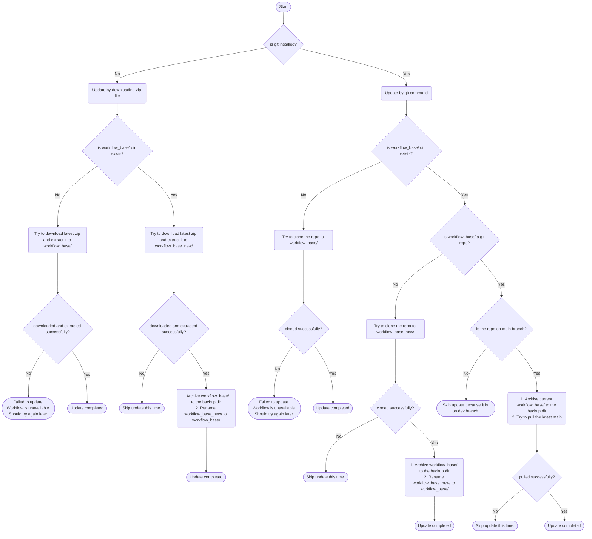

```mermaid
flowchart TD
    A([Start]) --> B{is git installed?}
    B -->|No| C(Update by downloading zip file)
    C --> E{is workflow_base/ dir exists?}
    E -->|No| F(Try to download latest zip \nand extract it to workflow_base/ )
    F --> H{downloaded and extracted successfully?}
    H -->|No| I([Failed to update. \nWorkflow is unavailable.\nShould try again later.])
    H -->|Yes| J([Update completed])
    E -->|Yes| G(Try to download latest zip \nand extract it to workflow_base_new/)
    G --> K{downloaded and extracted successfully?}
    K -->|No| L([Skip update this time.])
    K -->|Yes| M(1. Archive workflow_base/ to the backup dir\n2. Rename workflow_base_new/ to workflow_base/)
    M --> N([Update completed])


    B -->|Yes| D(Update by git command)
    D --> D1{is workflow_base/ dir exists?}
    D1 -->|No| D2(Try to clone the repo to workflow_base/)
    D2 --> D3{cloned successfully?}
    D3 -->|No| D4([Failed to update. \nWorkflow is unavailable.\nShould try again later.])
    D3 -->|Yes| D5([Update completed])

    D1 -->|Yes| D6{is workflow_base/ a git repo?}
    D6 -->|No| D7(Try to clone the repo to workflow_base_new/)
    D7 --> D8{cloned successfully?}
    D8 -->|No| D9([Skip update this time.])
    D8 -->|Yes| D10(1. Archive workflow_base/ to the backup dir\n2. Rename workflow_base_new/ to workflow_base/)
    D10 --> D11([Update completed])

    D6 -->|Yes| D12{is the repo on main branch?}
    D12 -->|No| D13([Skip update because it is on dev branch.])
    D12 -->|Yes| D14(1. Archive current workflow_base/ to the backup dir\n2. Try to pull the latest main)
    D14 --> D15{pulled successfully?}
    D15 -->|No| D16([Skip update this time.])
    D15 -->|Yes| D17([Update completed])
```
